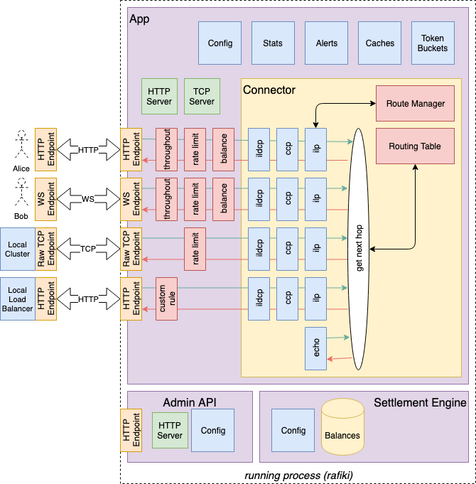

# rafiki

> A modular ILP connector with stand-alone settlement engine and router

<!--  -->

_Image Credit: [Felicia Ray](https://www.redbubble.com/people/feliciaray/works/29271134-rafiki?p=poster)_

**This is a BETA. There are still TODO's:**

*Dev* :
 - [ ] Check how connector reacts if child and gets own address.
 - [ ] Config for rafiki-connector
 - [ ] Exchange rate middleware
 - [ ] Synchronous/atomic settlement model (alternative balance rule and settlement engine)
 - [ ] Pluggable settlement and/or alternative settlement engines
 - [ ] Support unsolicited peer connections
 - [ ] Add TESTS
 
*Cleanup*:
 - [ ] Thorough code review 😬
 - [ ] CI/CD and some automation around commit checks
 - [ ] Check each package dependency and remove unnecessary ones
 
*Documentation*:
 - [ ] Documentation
 - [ ] Updated architecture diagram
 
## About

> More details coming soon, some major differences from `ilp-connector` below:

 - Stand-alone routing table and route manager
 - Stand-alone settlement engine
 - ~~Rules and protocols replace middleware and controllers and are instantiated per peer~~
 - Middleware and controllers now replace rules and protocols (Humble 🥧 🤣)
 

## Project

We designed Rafiki to be modular and therefor easy for work to be done on individual components in isolation. We encourage contributions especially in the form of new rules, protocols or settlement engines.

If you are keen to contribute please look at the issues, especially those labelled 'Good First Issue'.

### Folders

All source code is expected to be TypeScript and is placed in the `src` folder. Tests are put in the `test` folder.

The NPM package will not contain any TypeScript files (`*.ts`) but will have typings and source maps.

### Scripts

  - `clean` : Cleans the build folder and test output
  - `build` : Build the project
  - `lint`  : Run the linter over the project
  - `test`  : Run the unit tests and produce a code coverage report
  - `doc`   : Build the docs
